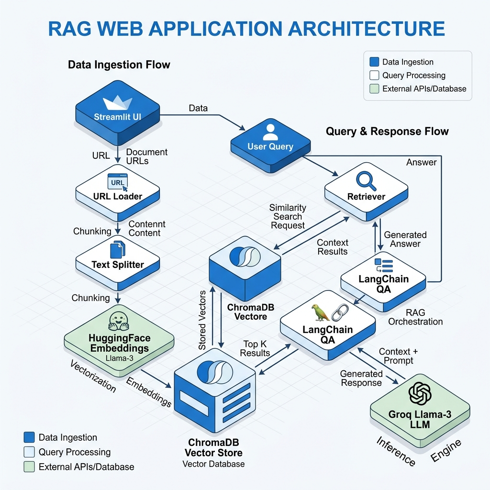

# Real Estate Research Tool: Retrieval-Augmented Generation (RAG) Application

## Overview
The Real Estate Research Tool is an intelligent web application designed to help professionals and investors extract actionable insights from unstructured online data. By providing up to three URLs containing real estate market reports, news articles, or financial forecasts, users can query the application in natural language and receive highly accurate, context-aware answers backed by specific source citations. 

This project demonstrates the practical application of Retrieval-Augmented Generation (RAG) pipelines to solve information overload in the real estate domain, drastically reducing research time and improving decision-making processes.

## Key Features
- **Dynamic Data Ingestion**: Automatically scrapes and loads unstructured text data from user-provided URLs.
- **Advanced Text Processing**: Utilizes recursive character text splitting to optimize document chunking for maximum retrieval context.
- **High-Performance Vector Storage**: Integrates ChromaDB for efficient semantic search and retrieval of relevant document chunks.
- **State-of-the-Art Language Models**: Powered by the Llama-3.3-70B model via Groq API for rapid and highly coherent answer generation.
- **Source Citation**: Enhances hallucination mitigation and user trust by explicitly returning the sources used to generate each answer.
- **Interactive User Interface**: Features a clean, responsive frontend built with Streamlit for seamless user interaction.

## Technologies and Frameworks
- **LangChain**: Orchestration framework connecting the data ingestion, vector store, and LLM generation chains.
- **Vector Database**: ChromaDB for local vector storage and similarity search operations.
- **Embeddings**: HuggingFace (`sentence-transformers/all-MiniLM-L6-v2`) for generating high-quality text embeddings.
- **Large Language Model (LLM)**: Llama-3.3-70B-Versatile via ChatGroq for natural language comprehension and generation.
- **Frontend**: Streamlit for rapid deployment of the interactive web application.

## System Architecture

The following diagram illustrates the data flow and system architecture of the RAG pipeline:



### Workflow
1. **Data Extraction**: Unstructured text is extracted from the provided web URLs using LangChain's `UnstructuredURLLoader`.
2. **Chunking**: The extracted text is divided into manageable segments using `RecursiveCharacterTextSplitter` to ensure the context window of the LLM is respected and retrieval is precise.
3. **Embedding**: Text chunks are converted into dense vector representations using a HuggingFace sentence transformer model.
4. **Storage**: Vectors are persistently stored in a local Chroma vector database.
5. **Retrieval**: Upon user query, the system performs a similarity search within the vector database to retrieve the most contextually relevant document chunks.
6. **Generation**: The retrieved context is passed alongside the query to the Groq-hosted Llama-3 model through a `RetrievalQAWithSourcesChain`, generating a comprehensive answer with strict adherence to the source material.

## Project Structure
```text
real_estate_tool/
├── main.py            # Streamlit application entry point. Handles the UI, state management, and user interactions.
├── rag.py             # Core RAG pipeline logic. Manages document loading, embedding, vector storage, and QA chains.
├── prompt.py          # Custom prompt templates to guide the LLM's persona as a real estate expert.
├── validation.py      # Utility functions for validating user-provided API keys asynchronously.
├── requirements.txt   # List of Python dependencies required to run the application.
├── .env.example       # Template for environment variables (e.g., GROQ_API_KEY).
├── .gitignore         # Git ignore rules to prevent tracking sensitive or unnecessary files.
├── Readme.md          # Project documentation (this file).
└── resources/         # Directory for local vector store and assets.
    └── vectorstore/   # ChromaDB persistent storage location where generated embeddings are saved.
```

## Installation and Setup

### Prerequisites
- Python 3.9 or higher
- An active [Groq API key](https://console.groq.com/keys)

### Steps
1. Clone the repository to your local machine:
   ```bash
   git clone <your-repository-url>
   cd real_estate_tool
   ```

2. Install the required dependencies:
   ```bash
   pip install -r requirements.txt
   ```

3. Set up the environment variables:
   Create a `.env` file in the root directory and add your Groq API key:
   ```text
   GROQ_API_KEY=your_api_key_here
   ```

4. Run the Streamlit application:
   ```bash
   streamlit run main.py
   ```

## Current Development Status
The core RAG pipeline and user interface are fully functional. Custom prompt engineering modules (such as `prompt.py`) are currently under active development and will be integrated in future updates to further refine the domain-specific behavior and tone of the language model.
